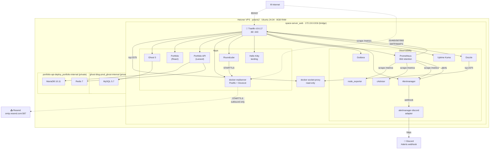

# Architecture

Detailed view of the space-server stack — how requests flow, where data lives, what talks to what, and the security boundaries between them.

For the high-level overview see the [README](README.md). For decision rationale see [`docs/decisions/`](docs/decisions/).

---

## Topology



> Test/demo containers (e.g. `whoami`) are intentionally excluded from the diagram.

---

## Network boundaries

Three Docker networks segment trust:

| Network | Purpose | Members |
|---|---|---|
| **`space-server_web`** | Public-facing edge plus all services Traefik routes to | Traefik, all 13 application/observability containers |
| **`ghost-blog-prod_ghost-internal`** | Ghost ↔ its MySQL only | Ghost, MySQL |
| **`portfolio-api-deploy_portfolio-internal`** | Laravel API ↔ MariaDB + Redis only | API, MariaDB, Redis |

The two `*_internal` networks have no path to the internet and no path from Traefik. **Database containers don't carry the `web` network attachment at all** — even if Traefik were compromised, Ghost's MySQL and the portfolio's MariaDB/Redis are unreachable. This is the partial network segmentation called out in `IMPROVEMENT-PLAN.md` F7; full segmentation would split `space-server_web` further into `edge`/`apps`/`mail`/`monitoring`.

---

## Request flows

### 1. HTTPS request to a public site

```
Browser  →  Hetzner :443  →  Traefik (TLS termination)
                              ├─ HSTS / CSP / X-Frame-Options via security-headers middleware
                              ├─ basic auth via auth@file middleware (internal sites only)
                              └─ HTTP forward → service container :PORT
```

Traefik's `docker-provider` discovers routes from container labels via the `docker-socket-proxy` (read-only). The certResolver is `letsencryptresolver` (TLS-ALPN-01 challenge); certs are stored in the `./traefik/letsencrypt/` host bind mount. Cert expiry is alerted at 14 days via the `TraefikCertExpiringSoon` rule.

### 2. Inbound mail (someone emails `cativo@cativo.dev`)

```
Sender's MTA  →  port 25  →  docker-mailserver
                              ├─ SpamAssassin
                              ├─ Postfix (queue)
                              └─ Dovecot (LMTP → Maildir)
                                  └─ /var/mail/cativo.dev/cativo/{cur,new}
```

The mail volume (`mail-data`) is the canonical inbox storage. Traefik is not in this path.

### 3. Outbound mail (replying from webmail)

```
Webmail  →  Mail (STARTTLS 587)  →  Postfix queue
                                     ├─ DEFAULT_RELAY_HOST = [smtp.resend.com]:587
                                     ├─ SASL auth user=resend pass=<re_...>
                                     └─ TLS 1.3 to Resend
                                         └─ Resend signs with their DKIM
                                            and delivers to recipient MTA
```

Hetzner blocks outbound port 25, so Postfix never tries direct MX delivery. See [ADR-0003](docs/decisions/0003-smtp-relay-via-resend.md).

### 4. Alert delivery

```
Prometheus  --(every 30s)-->  evaluate alert_rules.yml
       └── if firing for `for: ...`
           ├─ group_by (alertname, severity)
           ├─ group_wait 30s
           ├─ inhibit_rules (critical suppresses warning)
           └─ webhook → alertmanager-discord :9094
                         └─ format Discord embed
                            └─ POST → https://discord.com/api/webhooks/.../...
```

Repeat interval is 4 h; resolved notifications fire automatically when the underlying expression goes false (or after `resolve_timeout: 5m` for manually-injected alerts).

---

## Persistence

| Volume | What | Lifecycle |
|---|---|---|
| `mail-server_mail-data` | User mailboxes (Maildir) | Critical — backup before any mail container recreate |
| `mail-server_mail-state` | docker-mailserver internal state, DKIM keys | Critical |
| `mail-server_mail-config` | docker-mailserver runtime config | Recoverable from compose |
| `mail-server_mail-logs` | Postfix/Dovecot logs | Disposable |
| `mail-server_webmail-data` | Roundcube user prefs, SQLite | Convenient to keep |
| `ghost-blog-prod_db-data` | Ghost MySQL | Critical |
| `ghost-blog-prod_ghost-content` | Ghost themes, uploads | Critical |
| `portfolio-api-deploy_mysql-data` | Portfolio API MariaDB | Critical |
| `portfolio-api-deploy_redis-data` | API Redis (sessions, cache) | Convenient |
| `space-server_grafana-data` | Grafana DB (dashboards, users, prefs) | Convenient |
| `space-server_prometheus-data` | TSDB (30-day retention) | Disposable |
| `space-server_alertmanager-data` | Silence/group state | Disposable |
| `/mnt/hdd/uptime-kuma` | Uptime Kuma DB (bind mount) | Recoverable |
| `./traefik/letsencrypt/acme.json` | Let's Encrypt certificates | Recoverable (re-issue) |

"Critical" volumes are what `IMPROVEMENT-PLAN.md` F4 (deferred) addresses with `restic` → Hetzner Storage Box. Until F4 lands, the only recovery path for `mail-data` is a re-bootstrap and asking senders to resend.

---

## Deployment

```
local laptop                       polaris2
─────────────                      ────────
git commit + push  ──────────────▶ git pull
                                   docker compose up -d
                                   docker compose -f mail-server/  up -d  (if mail config changed)
                                   docker compose -f dozzle/       up -d  (if dozzle config changed)
                                   docker compose -f uptime-kuma/  up -d  (if uptime config changed)
```

A future improvement (`IMPROVEMENT-PLAN.md` F3) is to bring the application stacks under root compose via `include:`, collapsing the four `up -d` invocations into one.

CI (`.github/workflows/validate.yml`) runs on every push to `main` and every PR:

- `docker compose config --quiet` for all four compose files
- `promtool check config prometheus.yml`
- `promtool check rules alert_rules.yml`
- `amtool check-config alertmanager.yml`

A broken compose syntax or alert rule fails the workflow before merge.

---

## Secrets

Nothing sensitive is in the repo. All credentials live in `~/space-server/.env` and `~/space-server/mail-server/.env` on `polaris2`, both gitignored. The credential file `~/space-server-credentials.txt` (mode 600, off-repo) is the operator's reference of what's currently set.

| Secret | Location | Used by |
|---|---|---|
| Traefik basic-auth bcrypt hash | `traefik/dynamic/auth.yml` on host (gitignored) | Traefik file provider |
| Resend API key | `mail-server/.env` `RELAY_PASSWORD` | Postfix sasl_passwd |
| Discord webhook URL | `.env` `DISCORD_WEBHOOK` | alertmanager-discord adapter |
| Mail account hashes | `mail-server/docker-mailserver/accounts/{postfix,dovecot}-accounts.cf` (gitignored) | docker-mailserver |
| Grafana admin password | Grafana SQLite (set on first start via `GF_ADMIN_PASSWORD`, then DB-persisted) | Grafana |
| Let's Encrypt account key + certs | `traefik/letsencrypt/acme.json` (mode 600) | Traefik certResolver |

The original `auth.yml` apr1 hash was committed publicly for ~3 weeks before being caught; it has since been rotated to bcrypt and the file removed from tracking. The historical hash is invalidated.

---

## Pinned versions

All images are pinned to a specific version tag (or digest where a maintainer doesn't tag). The single source of `image:` lines is the docker-compose files in this repo; verifying what's running:

```bash
ssh polaris2 'docker ps --format "{{.Names}} {{.Image}}"'
```

Should match the compose files line-for-line. If anything drifts, that's the bug.

---

## See also

- [`IMPROVEMENT-PLAN.md`](IMPROVEMENT-PLAN.md) — open findings and roadmap
- [`docs/decisions/`](docs/decisions/) — architecture decision records
- [`CHANGELOG.md`](CHANGELOG.md) — what changed when
