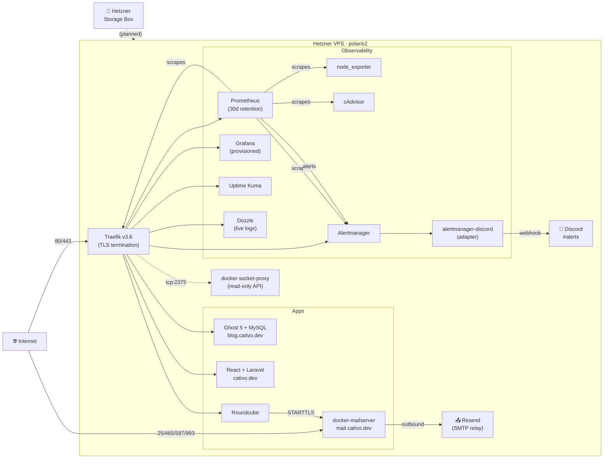

<div align="center">

```
  _____ ____  ___   ____________   _____ __________ _    ____________ 
  / ___// __ \/   | / ____/ ____/  / ___// ____/ __ \ |  / / ____/ __ \
  \__ \/ /_/ / /| |/ /   / __/     \__ \/ __/ / /_/ / | / / __/ / /_/ /
 ___/ / ____/ ___ / /___/ /___    ___/ / /___/ _, _/| |/ / /___/ _, _/ 
/____/_/   /_/  |_\____/_____/   /____/_____/_/ |_| |___/_____/_/ |_|  
```

</div>

# Space Server

> My completely self-hosted personal infrastructure. From an old laptop to a production VPS — mail, blog, portfolio, monitoring, and alerting, all dockerized.

[](LICENSE)
[](https://www.docker.com/)
[](https://traefik.io/)
[](https://prometheus.io/)
[](https://grafana.com/)

## Why this exists

I was tired of depending on third-party services for basic things like email and hosting. I wanted full control over my data and to learn how modern web infrastructure actually works. So I turned an old laptop into a home server and eventually migrated it to a VPS when the hardware couldn't keep up anymore.

This repo is the source of truth for that infrastructure — every service, every config, every lesson learned along the way.

## What runs here

**Current production:** Hetzner VPS (8GB RAM, Intel Xeon, Ubuntu 24.04). 20 containers across 12 public subdomains.

### Public subdomains

| URL | Service |
|---|---|
| [cativo.dev](https://cativo.dev) | Portfolio (React) |
| [api.cativo.dev](https://api.cativo.dev) | Portfolio API (Laravel) |
| [blog.cativo.dev](https://blog.cativo.dev) | Ghost 5 blog |
| [mail.cativo.dev](https://mail.cativo.dev) | Roundcube webmail |
| `devi.cativo.dev` | Hello Kitty landing |
| `grafana.cativo.dev` | Grafana — metrics + dashboards |
| `prometheus.cativo.dev` | Prometheus UI (basic auth) |
| `alertmanager.cativo.dev` | Alertmanager UI (basic auth) |
| `dozzle.cativo.dev` | Dozzle — live container logs (basic auth) |
| `uptime.cativo.dev` | Uptime Kuma — external probes |
| `traefik.cativo.dev` | Traefik dashboard (basic auth) |

Plus SMTP/IMAPS on the standard mail ports.

### Stack layers

| Layer | What |
|---|---|
| **Edge** | Traefik v3.6 — automatic Let's Encrypt SSL, basic-auth on internal dashboards, security headers, bcrypt hashes only |
| **Mail** | docker-mailserver (Postfix + Dovecot + SpamAssassin) with SPF/DKIM/DMARC; Roundcube webmail over STARTTLS; outbound via Resend SMTP relay (Hetzner blocks port 25) |
| **Apps** | Ghost 5 (MySQL backing it), React + Laravel portfolio (Laravel API has MariaDB + Redis), hello-kitty landing |
| **Observability** | Prometheus (30-day retention), node_exporter, cAdvisor, Alertmanager → Discord webhook (via `alertmanager-discord` adapter), Grafana with provisioned dashboards (Node Exporter Full, Traefik standalone, cAdvisor), Uptime Kuma for external probes, Dozzle for live container logs |
| **Plumbing** | docker-socket-proxy with minimal API surface (Swarm endpoints disabled), git-on-prod deploy (`git pull && docker compose up -d`) |

Databases and caches (Ghost's MySQL, portfolio's MariaDB, portfolio's Redis) live on **internal-only docker networks** — they're not reachable from the edge.

## Architecture



## Production stories

A few real incidents from running this. Each one taught me something I now apply by default.

### 🔐 The basic-auth hash that was sitting in the public repo

While preparing to make the production server a proper git working copy, I discovered the apr1 (Apache MD5) hash protecting `traefik.cativo.dev`, `prometheus.cativo.dev`, and `dozzle.cativo.dev` had been committed to the public repo for three weeks. The `$$` in the YAML was Docker Compose env-var escape syntax — to Traefik's file provider it reads as a single `$`, so the hash was real.

Resolved by rotating to bcrypt, dropping the auth file (and the mail account files, same risk) from tracking, adding `.example` templates with placeholder hashes, and switching Traefik's volume bind from file-scope to directory-scope so future `sed -i` edits don't break the bind mount via inode replacement. The new credential lives in a 600-perm file outside any repo until it makes it to a password manager.

### 🌐 The network that worked by accident for three weeks

Mail routing broke right after a Traefik recreate. Turned out `mail-server/docker-compose.yml` referenced `web: external: true` (a literal network name `web`) while every other stack — ghost, portfolio, Dozzle, Uptime Kuma — used the project-prefixed `space-server_web`. The routing had been held together by a manual `docker network connect web traefik` that someone (past me) had run out-of-band; the Traefik recreate dropped that side-effect and exposed the latent mismatch. Fix was to point the mail-server stack's network reference at the canonical `space-server_web` via Compose's `name:` override, then delete the orphan `web` network. Now there's exactly one network and zero magic.

### 📧 Webmail "login failed" after a clean container recreate

After fixing the network issue, Roundcube started rejecting every login with dovecot's `disable_plaintext_auth=yes` kicking in even though both containers shared the docker network. docker-mailserver doesn't auto-populate dovecot's `login_trusted_networks`, so plaintext IMAP from webmail was being refused. Rather than poke holes in dovecot's defaults, I switched Roundcube's `imap_host` and `smtp_host` to `tls://mail` (STARTTLS) in both the env vars and the inline entrypoint heredoc. Cert is self-signed for internal traffic, and `verify_peer = false` was already set. Verified end-to-end with `openssl s_client -starttls imap` returning `OK Pre-login`.

More incidents and their fixes live in commit messages — they're all `fix(scope): description (Fxx)` and reference the [improvement plan](IMPROVEMENT-PLAN.md).

## How I work

The [`IMPROVEMENT-PLAN.md`](IMPROVEMENT-PLAN.md) tracks every finding from a structured architecture review: P0 critical bugs and security, P1 resilience and observability, P2 hardening, P3 quality-of-life. Items get checked off with a one-line note explaining what shipped and a reference back to the commit. It's the same artifact I'd expect to keep on a small team.

## Tech stack

- **Reverse proxy:** Traefik v3.6 (Let's Encrypt, file + docker providers, basic auth + security-headers middleware)
- **Mail:** docker-mailserver, Roundcube (STARTTLS internal), Resend SMTP relay (outbound)
- **Monitoring:** Prometheus, Alertmanager, node_exporter, cAdvisor, Grafana with provisioning, alertmanager-discord sidecar
- **Apps:** Ghost 5, React frontend, Laravel API, MySQL/MariaDB, Redis
- **Ops:** Docker Compose v2, git-on-prod, Discord alerting

## Quick start

```bash
git clone https://github.com/cativo23/space-server.git
cd space-server

# Configure secrets (none are committed)
cp .env.example .env
cp traefik/dynamic/auth.yml.example traefik/dynamic/auth.yml
# Edit .env and auth.yml with your own values
# Generate a bcrypt hash for traefik auth:
#   docker run --rm -i httpd:2-alpine htpasswd -niB admin <<< 'your-strong-password'

# Start the stack
docker compose up -d
```

**Important:** the mail server needs DNS (MX/SPF/DKIM/DMARC). If your provider blocks outbound port 25 (Hetzner does), configure the `RELAY_*` env vars in `mail-server/.env` to route through Resend / Mailgun / Postmark / etc.

## Things I learned

**What worked:**
- Automated migration scripts pay for themselves the moment you need to recover
- Traefik + Let's Encrypt makes SSL a non-issue across 15+ subdomains
- Docker Compose is enough for a single-node setup — Kubernetes would be cargo culting
- Provisioning Grafana from files in git makes dashboards reproducible
- Conventional commit messages with the *why* in the body pay off when you `git log` six months later

**What didn't work:**
- Committing credential templates with real-looking values (any plausible-looking hash is assumed exposed once it's public)
- File-scope bind mounts in Docker — `sed -i` replaces the inode and the container keeps reading the old one
- Mixing project-prefixed and literal network names across compose files
- Trusting that "PERMIT_DOCKER=network" propagates to every protocol in docker-mailserver (it doesn't; STARTTLS instead of plaintext is the right answer anyway)

## Roadmap

Tracked in [`IMPROVEMENT-PLAN.md`](IMPROVEMENT-PLAN.md). Currently open:

- **F3** — single source of truth via Compose `include:` (Ghost / portfolio / portfolio-api currently in sibling repos)
- **F6** — Loki + Promtail for log retention and Grafana correlation
- **F7** — split flat `web` network into `edge` / `apps` / `mail` / `monitoring`
- **F8** — DNS-01 challenge for wildcard cert
- **F4** — automated backups via `restic` → Hetzner Storage Box
- **Eventually** — Ansible playbook for full reproducibility from a fresh VPS

## Repo structure

```
space-server/
├── docker-compose.yml          # Root stack: edge + observability
├── mail-server/                # Mail (Postfix/Dovecot + Roundcube)
├── traefik/                    # Reverse proxy + Let's Encrypt
├── prometheus/                 # Scrape config + alert rules
├── alertmanager/               # Discord routing + inhibit rules
├── grafana/                    # Provisioned datasource + dashboards
├── dozzle/                     # Live container logs UI
├── uptime-kuma/                # External uptime probes
├── scripts/                    # Migration automation
├── IMPROVEMENT-PLAN.md         # Architecture roadmap (active)
└── CHANGELOG.md                # Keep-a-Changelog format
```

## Requirements

- VPS with at least 4GB RAM (8GB recommended)
- Domain with DNS access (Cloudflare works great; pure DNS-only mode for mail records)
- Docker + Docker Compose v2
- An SMTP relay account if your provider blocks outbound port 25

## Contributing

Mostly a personal project, but if you spot a bug or want to suggest something, [open an issue](https://github.com/cativo23/space-server/issues). See [CONTRIBUTING.md](CONTRIBUTING.md).

## License

MIT — do whatever you want with this. If it helps you, great.
